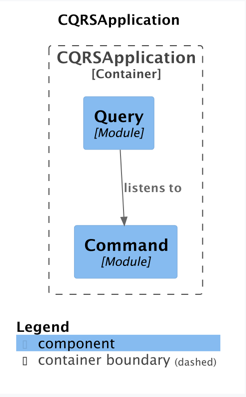

# CQRS with Spring Modulith 

This project demonstrates how to implement the Command Query Responsibility Segregation (CQRS) pattern using Spring Modulith.



*Generated using ModulithStructureTest*

## Project Structure

The application is organized into distinct modules:

- **Command Module**: Handles write operations and business logic
- **Query Module**: Optimized for read operations
- **Shared**: Open Module Cross-cutting config

## Technology Stack

- Java 23
- Spring Boot 3.4.3
- Spring Modulith 1.3.3
- Spring Data JPA

## Running the Application

To run the application:

```bash
./gradlew bootRun
```

